<!-- ====== CRT / 90s Videogame README for @amritaa1106 ====== -->

  <!-- Retro banner (will swap to an animated CRT later) -->
  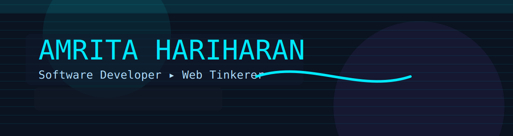

  <!-- Typing intro (retro terminal vibe) -->
  

---

<!-- HUD header -->

  <code>PLAYER:</code> <strong>AMRITA HARIHARAN</strong> &nbsp;•&nbsp;
  <code>CLASS:</code> Software Developer &nbsp;•&nbsp;
  <code>EMAIL:</code> <a href="mailto:amrita.hariharan2006@gmail.com">amrita.hariharan2006@gmail.com</a>

  
  
  

## 🎮 About (Lore)

> “Pixel-perfect UI meets practical engineering.”  

- 🔭 I love building **interactive, aesthetic, user-friendly** web experiences.  
- 🌱 Currently exploring **Machine Learning**, **MERN**, and playful **creative coding**.  
- 💬 Ask me about **Web Dev**, **JavaScript**, **React**, **APIs**.  
- 📫 Reach me at **amrita.hariharan2006@gmail.com**.

---

## 🕹️ Tech Arcade (Animated Stack)

<table align="center" style="width:100%; min-width:720px; border-spacing:14px;">
  <tr>
    <td width="28%"><strong>Frontend</strong></td>
    <td>
      <!-- Animated SVG/GIF placeholders: to be added -->
      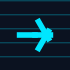
      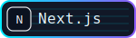
      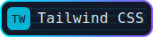
      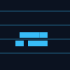
    </td>
  </tr>
  <tr>
    <td><strong>Backend</strong></td>
    <td>
      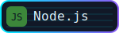
    </td>
  </tr>
  <tr>
    <td><strong>Databases</strong></td>
    <td>
      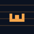
      
      
    </td>
  </tr>
  <tr>
    <td><strong>Languages</strong></td>
    <td>
      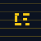
      
      
      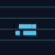
      
      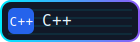
    </td>
  </tr>
  <tr>
    <td><strong>Tools</strong></td>
    <td>
      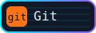
      
    </td>
  </tr>
</table>

  

---

## 🧾 Quest Log (Activity & Stats)

  <!-- Activity graph -->
  

   

  <!-- Summary cards -->
  
  
  
  
  

---

## 🎲 Fun Facts

- Loves everything aviation ✈️  
- Sometimes feels like an imposter while coding (relatable stat buff: +10 resilience)  
- Always ready to do something fun 🎉  

---

<small>© 2025 — Insert coin to continue…</small>

